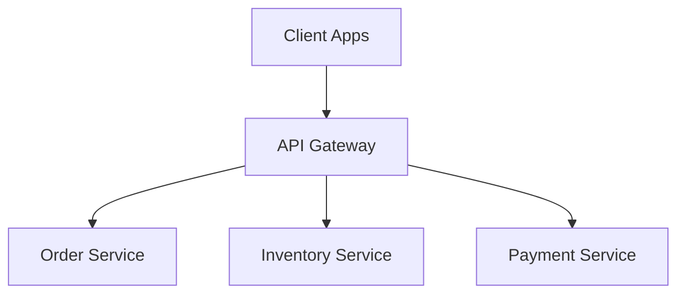

## Descriptions

NCryptsion

## What is an API Gateway?

An API Gateway is a server that acts as an API front-end, receiving API requests, enforcing throttling and security policies, passing requests to the back-end service, and then passing the response back to the requester.

## Core Responsibilities
- **Routing:** Directing requests to the appropriate microservice.
- **Authentication & Authorization:** Verifying the identity of the requester.
- **Rate Limiting:** Protecting services from being overwhelmed by too many requests.
- **API Composition:** Aggregating data from multiple services into a single response.
- **Protocol Translation:** Converting between different protocols (e.g., REST to gRPC).

## Popular API Gateway Tools
- **Kong:** An open-source, cloud-native API gateway built on top of Nginx.
- **Amazon API Gateway:** A fully managed service that makes it easy for developers to create, publish, and secure APIs.
- **Tyk:** An open-source API Gateway that is fast and scalable.
- **Traefik:** A modern HTTP reverse proxy and load balancer that makes deploying microservices easy.

## Architecture Pattern
In a microservices architecture, instead of clients calling each service directly, they call the API Gateway which handles the orchestration.

## References
### Website
- [https://microservices.io/patterns/apigateway.html](https://microservices.io/patterns/apigateway.html)
- [https://www.redhat.com/en/topics/api/what-does-an-api-gateway-do](https://www.redhat.com/en/topics/api/what-does-an-api-gateway-do)

